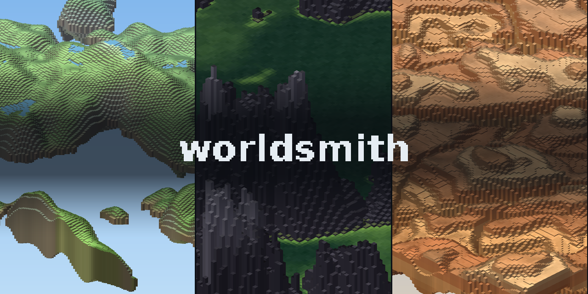

<p align="center">
  
  
  
  
</p>

**Describe a world out loud and let an AI build it.** worldsmith is Minecraft's
world generation reimplemented in Python, bit for bit, so a model can draw the
terrain in a couple of seconds instead of launching the game and flying around
to find out what it made.

That is the part that matters. Most tools write worldgen JSON and hope. Here the
model writes the JSON, renders it, **looks at the picture**, and goes back and
changes a number. It is the loop a human would use, running at machine speed.

```bash
git clone https://github.com/Msde-7/worldsmith
cd worldsmith
pip install -r requirements.txt
```

Now open [Claude Code](https://claude.com/claude-code) in that folder and ask for
something.

> make me a world of sheer basalt spires over an acid sea

The skill in `.claude/skills/worldsmith/` takes it from there. It writes the
density functions, validates them, renders the result, looks at the image,
adjusts what is wrong, and installs the finished world in your saves folder ready
to walk into. Every pack in this repository was built exactly that way.

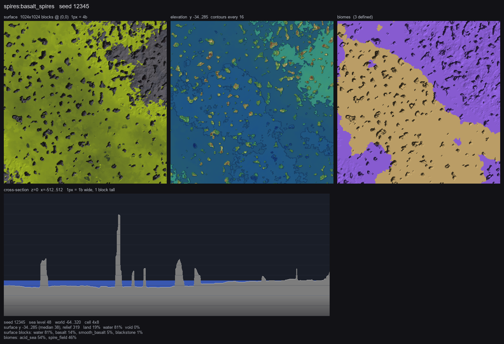
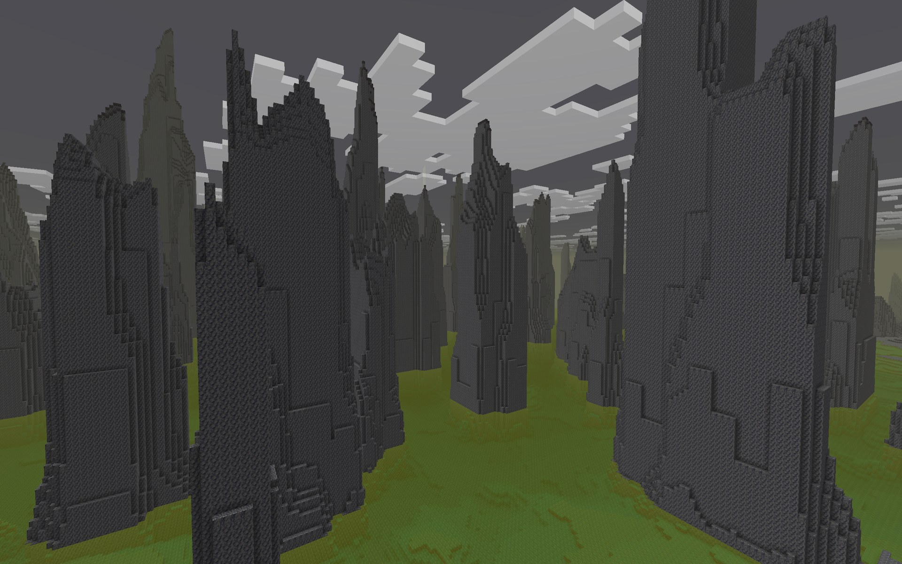

## From words to knobs

Terrain is shaped by about six numbers. The useful thing is knowing which one a
phrase actually means, and that mapping is what the skill carries.

| you say | it changes |
|---|---|
| higher or lower ground | the `offset` spline |
| flatter, plateaus, mesas | raise `factor` |
| dramatic, mountainous | lower `factor` |
| spiky, jagged peaks | `jaggedness` above zero, near ridges only |
| sheer cliffs | high `factor` plus a sharp step in `offset` |
| overhangs and arches | low `factor`, heavier 3D noise |
| floating islands | make `depth` a band instead of a ramp |
| different rock, sand, snow | the surface rule |
| caves | the `--caves` flag |

## It really is the same terrain

This only works if the picture can be trusted, so that gets measured rather than
claimed. `tools/verify_in_game.py` runs a real Minecraft 26.2 server on the pack,
reads the heightmaps back out of the region files, and compares them column by
column.

```
$ python tools/verify_in_game.py packs/basalt_spires
columns compared : 331776
exact matches    : 331776 (100.000%)
max  |error|     : 0 blocks
```

Same story on vanilla's own terrain, aquifers and all. 51,200 columns, 99.959%
exact, mean error 0.002 blocks. Aquifers are the hard part, because the game
walls off underground water with stone that shows up in the heightmap. Modelling
them took that sample from 99.19% to 99.96%.

Underneath, 170 checks pin the engine to
[deepslate](https://github.com/misode/deepslate) and to real JVM output. All 35
vanilla density functions, all 7 dimension routers, every noise and every random
number stream, bit for bit.

## One render, four views

What it looks like, how tall it is, where the biomes landed, and a cut through
the middle for overhangs, caves and hollows.

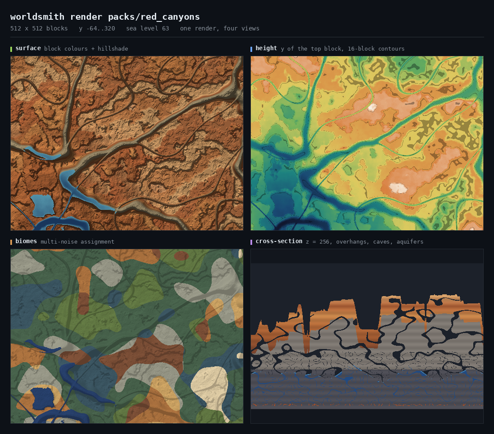

Change one thing and look again. Here is the basalt spires pack on its first
pass, its third, and its last.

| first attempt | narrower, taller | final |
|---|---|---|
| 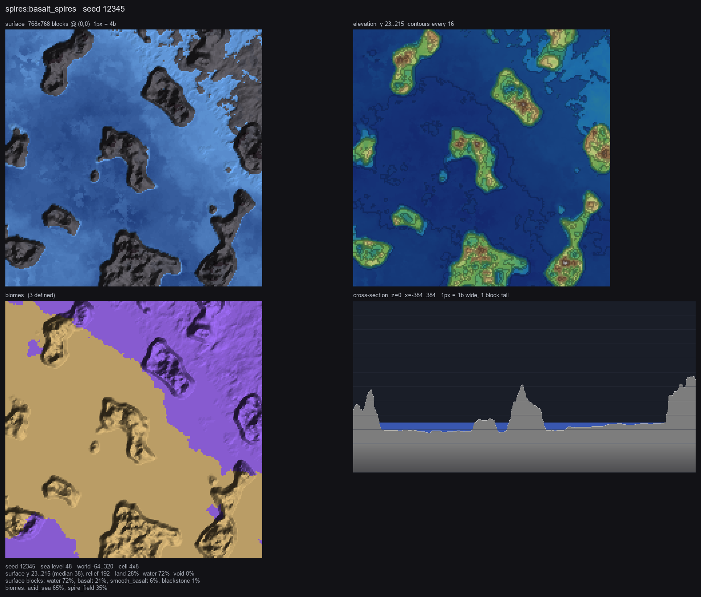 | 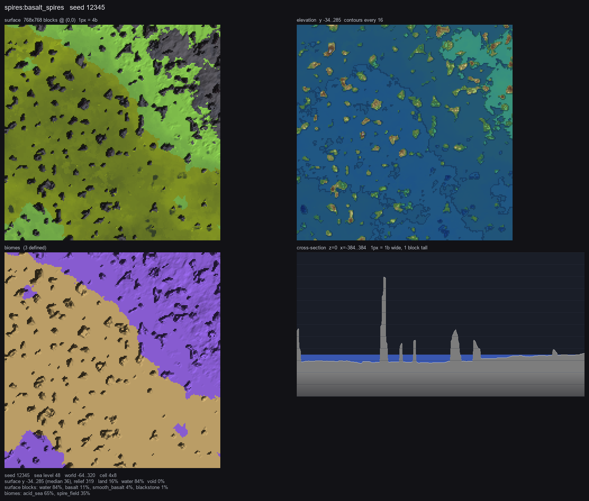 |  |

Blobby islands became spires by raising the spire mask threshold so only the top
few percent of columns qualify, then steepening the height spline. Thirty
seconds, no world reload.

`--size 256 --step 1` renders block by block instead of one pixel per noise cell,
which is the view for close-ups.

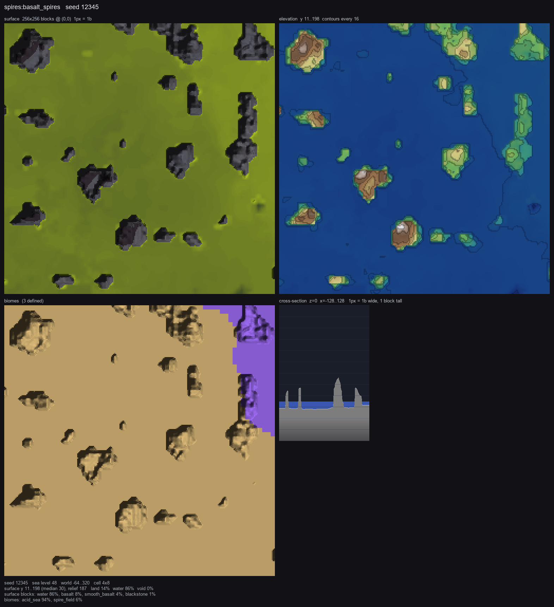

Features are placed by the game after generation, so a render is bare ground and
a wood comes out looking like a field. `--decorate` follows the trees in each
biome's own feature list, works out how much canopy they add up to and what
colour the leaves are, and stipples that over the map. It is an estimate of
cover, not a placement: the game rolls the positions against a random source and
a survival check the renderer does not run, so the woods land in the right
biomes rather than on the right blocks, and nothing about it reaches the terrain
or the in-game comparison.

| bare | `--decorate` |
|---|---|
| 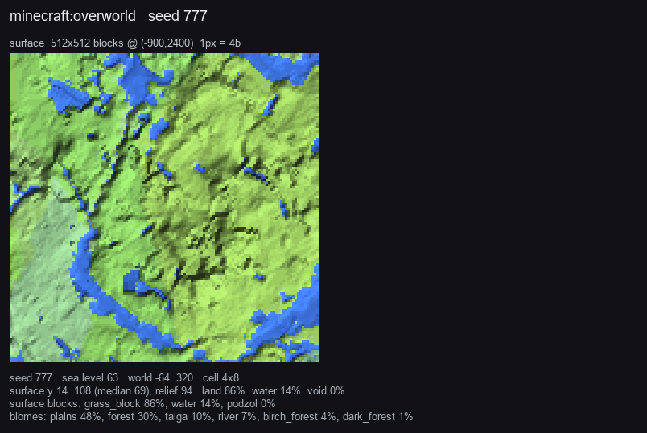 | 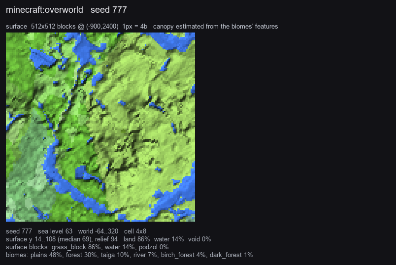 |

## Into the game

`worldsmith play` is the last mile in one command. It rewrites the pack's
dimension as the overworld, fetches a server jar and Java runtime, **uses the
renderer to pick a spawn worth spawning at**, meaning flat ground with the
biggest landmark in view, pre-builds the chunks around it, and installs the save
into `.minecraft/saves` with creative and cheats on.

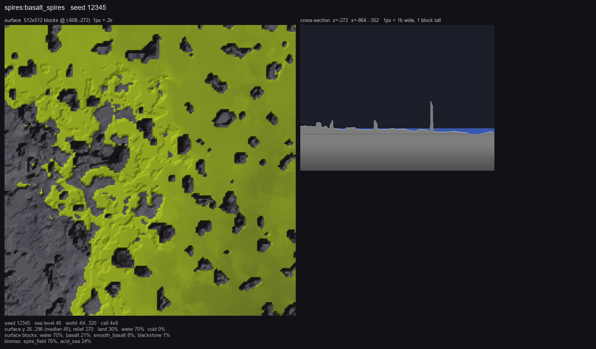

It only adds that one save. The pack it copies into `.minecraft/datapacks` just
shows up in the Data Packs list on the world-creation screen, so New World still
gives you an ordinary world. Running the server writes `eula=true` inside
`.runtime/`, which accepts Mojang's EULA.

## The packs in here

**red_canyons**, a tableland cut by slot gorges. The canyon network is
`abs(noise)` near zero along a winding line, and the benches are a staircase
spline that turns smooth noise into flat tops with abrupt risers.

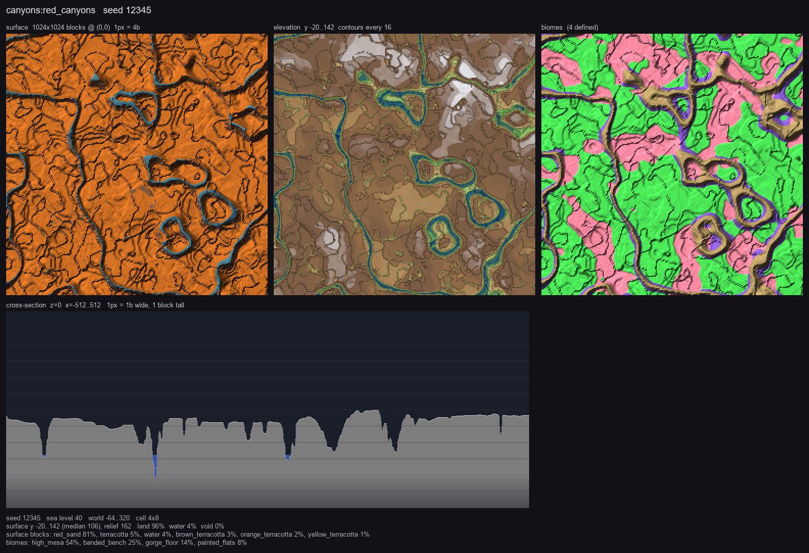
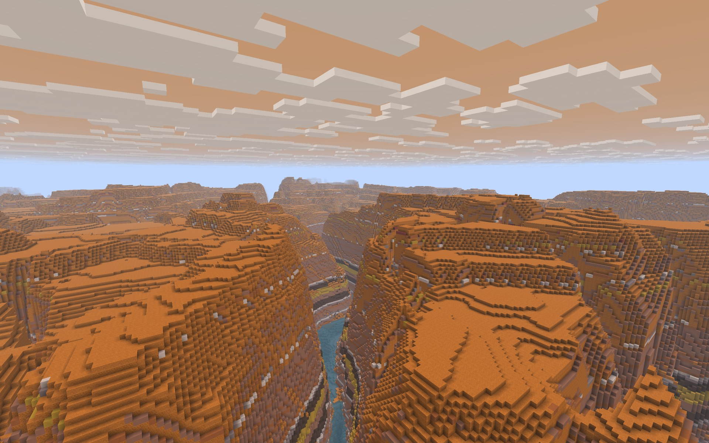

**sky_islands**, where `depth` is a band instead of a ramp, two opposing y
gradients min-ed together, so terrain has a top *and* a bottom and the void takes
the rest. **gilded_isles** does the same trick from the other end, subtracting
the distance to a mid-plane that moves per column, so every island floats at its
own height and its roots taper away underneath.

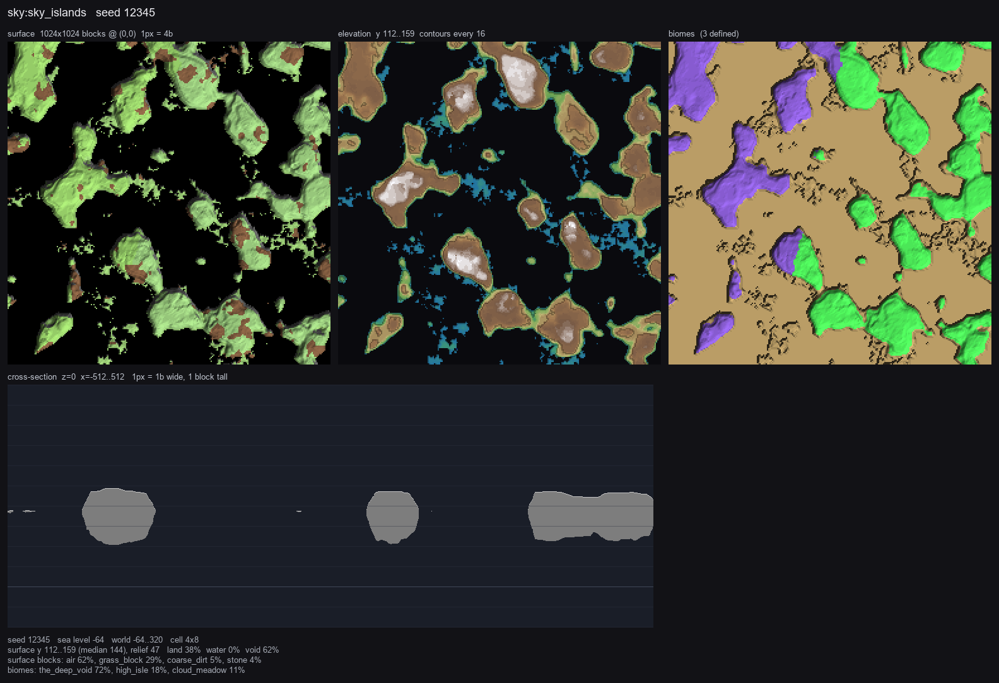
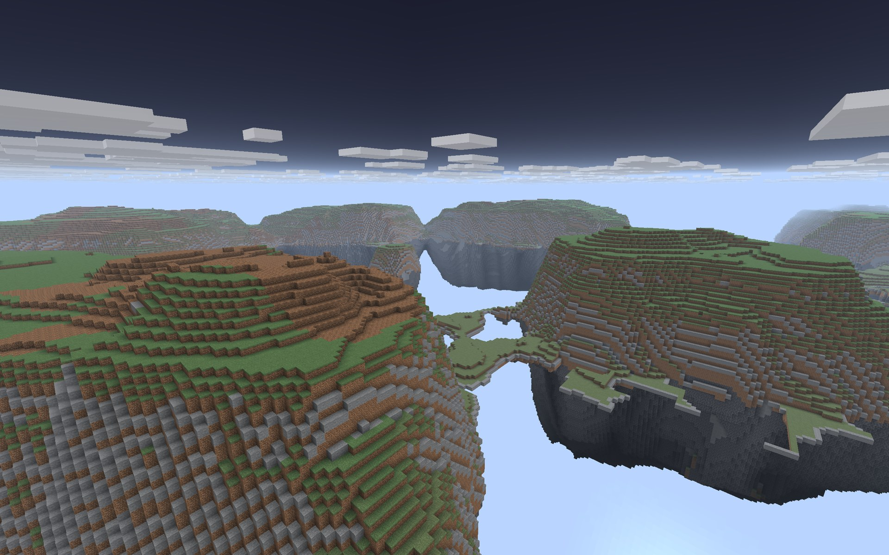
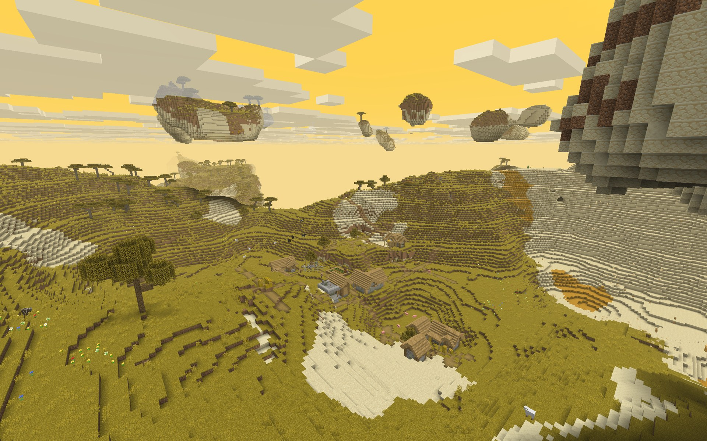

That village on the middle island is not decoration. Structures reach a custom
world through biome tags, so `gilded_isles` lists its own biomes under
`has_structure/village_plains` and the game does the rest. The same tags switch
mineshafts and ancient cities off, because those anchor to fixed low altitudes
and would otherwise hang in the sky underneath the islands.

**terraced_mesas**, a nine-level staircase spline with flat treads and narrow
risers, so the land climbs in terraces to about y 210, and a surface rule that
bands the whole mesa into strata. Cliffs, terrace edges and cave walls all cut
through the layers.

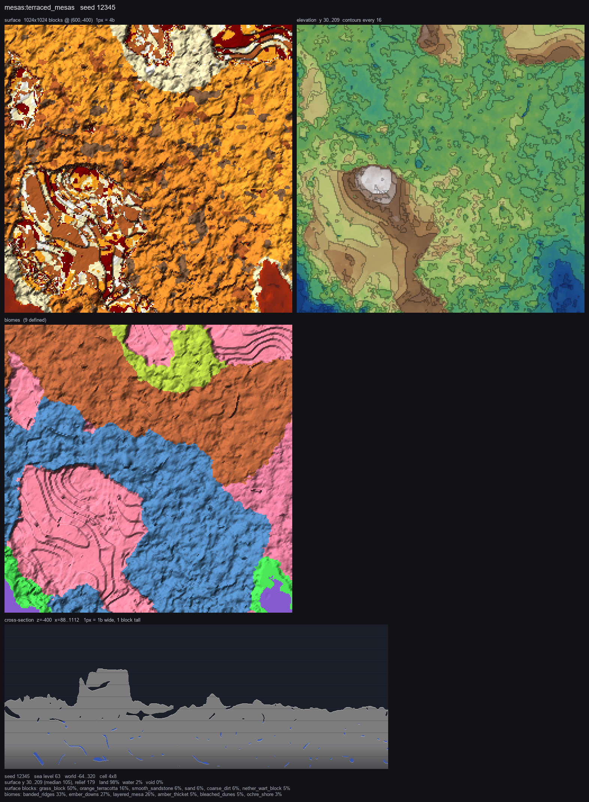

`worldsmith new` scaffolds a plain continents-and-oceans world laid out to be
edited, rendered in `renders/starter.png`.

## Doing it by hand

```bash
worldsmith new     packs/mine --namespace mine --name mine [--caves] [--like minecraft:plains]
worldsmith check   packs/mine        # schema, dangling refs, dead biomes, biome tags, smoke test
worldsmith render  packs/mine --out renders/mine.png [--decorate]
worldsmith play    packs/mine        # into Minecraft
worldsmith export  packs/mine        # a zip for someone else's game
worldsmith reference terrain         # the height formula and what every knob does
worldsmith probe   packs/mine --at 100 64 -200 --density mine:offset mine:factor
worldsmith column  packs/mine --at 100 -200      # one column, top to bottom
```

Run them as `python -m worldsmith.cli <command>` from the repository. `check` is
the one to run before every render, because Minecraft rejects malformed worldgen
silently at world creation and hands you a void world. The validator covers every
node type and field, dangling references, spline ordering, block ids and
properties, the mandatory router fields, biome tags, and biome boxes that can
never win.

<details>
<summary><b>Caves, aquifers, and why they go together</b></summary>

`--caves` cuts vanilla's cave system into the terrain. Vanilla's caves are
density functions rather than carvers, so these are the one kind of cave the
preview draws exactly. They have to go inside the `interpolated` node the way
vanilla does it. A world that cut them in outside that node matched the game on
87% of columns against 100% for the shape vanilla uses, which is the sort of
thing you only find by generating both, with aquifers off on both sides so only
the placement differed.

`--caves` turns aquifers on with them and writes the four aquifer router fields
that make that mean anything. Caves without aquifers flood, because the game has
no water table to consult, so it fills every cavity below sea level with water
and everything under y=-54 with lava. On a 400 column sample only 5% of the cave
volume came out as air, against 91% with aquifers on.

Two consequences worth knowing. Such a pack renders on the exact per-block scan,
roughly 5x slower, because a cave layer makes `final_density` a `min` and the
density is then no longer linear in y. And the cave functions carry vanilla's own
altitudes, with `noodle` gated to y -60..321 and `entrances` ramping between y -10
and 30, so a pack that moves `min_y` or `height` keeps its caves where vanilla put
them.

Aquifers are also the one part of the engine that is not exact, so a cave pack
previews a little less precisely than a plain one. Against a real server over
331,776 columns, `--caves` came out 99.441% exact and 99.724% within one block,
mean error 0.017 blocks. The columns it misses are the ones where the game perches
a body of water or drops a barrier lid over a cavity and the engine puts it a few
blocks off. A plain pack has no aquifers and stays exact.

`--like minecraft:plains` borrows a vanilla biome's trees, ores, mobs and carvers.
These are features and carvers, not density functions, so the game places them
after generation and a render never shows them.

</details>

<details>
<summary><b>What is in here, and why it is fast</b></summary>

| | |
|---|---|
| `worldsmith/jrandom.py` | `java.util.Random` and xoroshiro128++, bit exact, plus `Mth.getSeed` |
| `worldsmith/noise.py` | ImprovedNoise, PerlinNoise, NormalNoise, BlendedNoise, 2D simplex |
| `worldsmith/kernels.py` | numba kernel for the Perlin inner loop, falling back to numpy |
| `worldsmith/density.py` | every density function node, compiled and vectorised |
| `worldsmith/terrain.py` | heightmaps and cross-sections, lattice or per-block sampling |
| `worldsmith/surface.py` | surface rules, including the badlands clay bands |
| `worldsmith/aquifer.py` | underground fluid levels and the stone barriers between them |
| `worldsmith/climate.py` | multi-noise biome assignment, presets, and unreachable-biome detection |
| `worldsmith/canopy.py` | how much canopy a biome's tree features come to, for `--decorate` |
| `worldsmith/validate.py` | schema, references, splines, block ids, biome boxes, biome tags |
| `worldsmith/render.py` | the four views and the contact sheet |
| `worldsmith/play.py` | server runtime, spawn picking, world install |
| `vanilla/26.2/` | the vendored vanilla data it is checked against |
| `tools/` | in-game verification, the deepslate oracle, block-colour extraction, the authoring scripts |

Renders are fast because every purely 2D function is evaluated once per column
rather than once per block, the Perlin inner loop is a parallel numba kernel, and
terrain is sampled on the noise-cell lattice whenever the pack's `final_density`
is rooted in an `interpolated` node, which makes that sampling exact. Anything
else, vanilla included, falls back to an exact per-block scan.

</details>

<details>
<summary><b>Known limits</b></summary>

* **Aquifer boundaries are not perfect.** The fluid levels and the barriers
  between them are modelled, but where the game's floodedness check is a near
  tie the engine can pick the other side, which is the last 0.04% of columns.
  Most custom packs leave `aquifers_enabled` off and are unaffected.
* **Carvers and features are not run**, so the trees, ores and ravines `--like`
  brings along are placed by the game afterwards. `--decorate` estimates how
  much canopy a biome's tree features come to and paints that on the map, which
  is cover rather than placement; the rest never shows up in a render. Noise
  caves are the exception, since they live in the density functions.
Vanilla itself, rendered by the engine, biomes and all. A dimension may name a
preset rather than list its biomes, which is what copying vanilla's overworld
and changing one spline gives you. Java assembles that table at runtime instead
of shipping it as data, so mcmeta's copy of it is the preset name again, and
`tools/extract_worldgen_data.py` runs the server jar's own data generator to
read out the real one: 7594 boxes over 55 biomes, vendored like the rest.

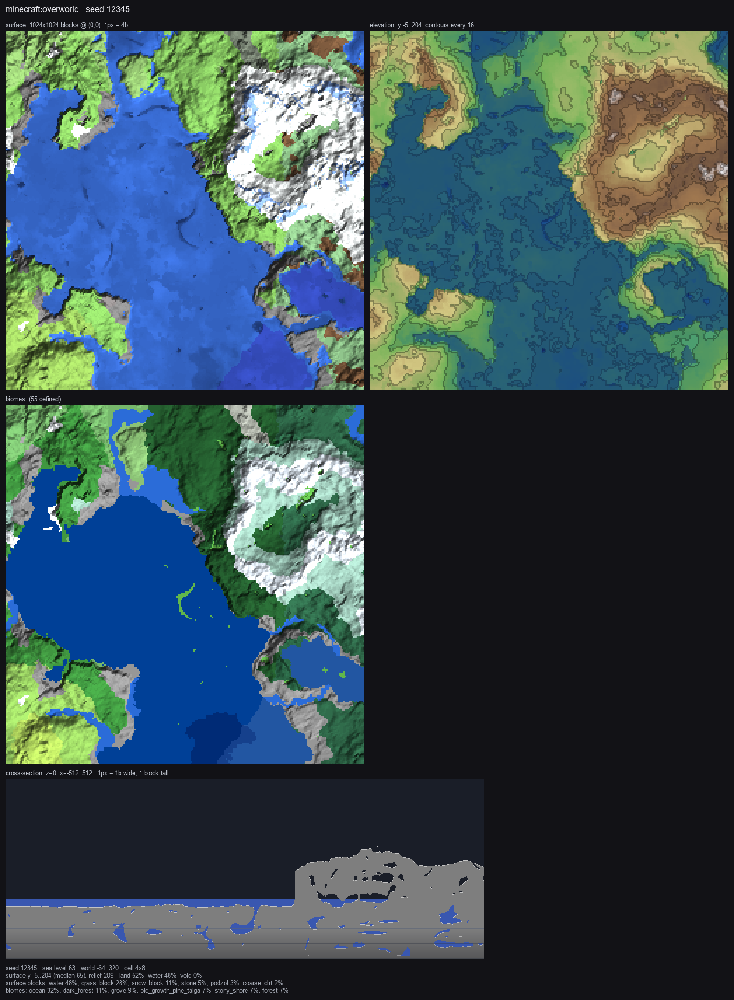

</details>

## Tests

```bash
python tests/run_all.py                              # 298 checks, no network
python tools/verify_in_game.py packs/basalt_spires   # the real game, opt-in
python tools/extract_block_colors.py                 # re-read block colours from the client jar
python tools/extract_worldgen_data.py                # re-read the preset biome tables and the features
```

Every one but the first downloads a server jar, a Java runtime or a client jar
into `.runtime/` on first use, and `verify_in_game` writes an `eula.txt` there.

## License and credit

MIT, see [LICENSE](LICENSE). One exception. `vanilla/26.2/` is Minecraft's own
worldgen data, extracted by [misode/mcmeta](https://github.com/misode/mcmeta) and
vendored here so the engine can be checked against it. That data belongs to Mojang
and is not covered by this license.

The engine is validated against [deepslate](https://github.com/misode/deepslate)
(MIT) by misode, which also powers
[misode.github.io/worldgen](https://misode.github.io/worldgen). worldsmith is an
independent project and is not affiliated with Mojang or Microsoft.
